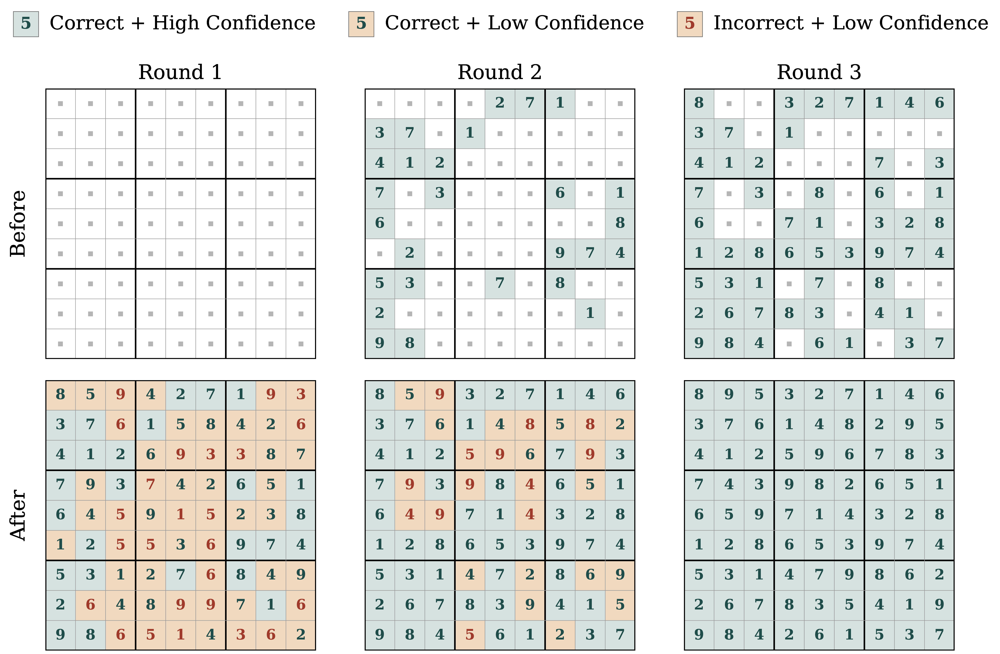

<h1 align="center">Posterior Refinement:<br>Fast Language Generation via Any-Order Flow Maps</h1>

<div align="center">

**[Manan Agarwal](https://mananag007.github.io)**<sup>*1</sup>, **[Sheel Shah](https://sheelfshah.github.io)**<sup>*1</sup>, **[Chanhyuk Lee](https://david3684.github.io)**<sup>2</sup>, **[Jaehoon Yoo](https://sites.google.com/view/jaehoon-yoo/홈)**<sup>2</sup>, **[Jerry Huang](https://jrrhuang.github.io/)**<sup>1</sup>, \
**[Seunghoon Hong](https://maga33.github.io/)**<sup>2</sup>, **[Aditi Raghunathan](https://www.cs.cmu.edu/~aditirag/)**<sup>1</sup>, **[Jinwoo Kim](https://jw9730.github.io/)**<sup>†2</sup>, **[Nicholas M. Boffi](https://nmboffi.github.io/)**<sup>†1</sup>


<sup>1</sup>Carnegie Mellon University &nbsp; <sup>2</sup>KAIST &nbsp; <sup>*</sup>Equal contribution &nbsp; <sup>†</sup>Equal advising
</div>

<div align="center">

[](https://arxiv.org/abs/2606.24773)
[](https://posterior-refinement.github.io/)
[](https://drive.google.com/drive/folders/1SfcZhOx0BEL1NRIDH8EM000D9mPv6-Dy?usp=sharing)

</div>

## Official Code Repository

<p align="center">
  
</p>

**Posterior Refinement with FMLM+.** Posterior Refinement lets the model judge the fit of each token after the fact and fix its own mistakes in parallel. The model generates all tokens in parallel and scores each token's posterior confidence given the entire draft. It commits the high-confidence tokens, re-noises the rest, and repeats.

## Abstract

Non-autoregressive generation promises **iterative refinement** — recursively critiquing, erasing, and regenerating arbitrary subsets of tokens — but existing models fail to realize it. **Masked Diffusion Models (MDMs)** suffer from factorization error, so sample quality collapses when many tokens are generated simultaneously. **Flow Map Language Models (FMLMs)** sidestep this bottleneck through joint sequence transport, achieving excellent few-step generation, but sacrifice the inference-time flexibility of MDMs.

We introduce **FMLM+**, a framework that bridges this gap by equipping FMLM with **masking-style noise schedules**. While generating the full sequence in a single step, FMLM+ simultaneously scores the global consistency of each token **_a posteriori_**. We leverage this to introduce **Posterior Refinement**, an inference-time strategy that lets the model adaptively self-correct its outputs — matching the performance of discrete baselines with up to **32× fewer NFEs**. Across diverse benchmarks, FMLM+ with Posterior Refinement improves the speed–quality tradeoff over both the MDM and FMLM families, providing a scalable foundation for high-fidelity language modeling.

Please refer to our [paper](https://arxiv.org/abs/2606.24773) for more details on method and results.

## How to Run

### Install Dependencies

```bash
pip install torch>=2.3.0
pip install -r requirements.txt
# Install flash-attn separately matching your python / torch version (see https://github.com/Dao-AILab/flash-attention/releases)
pip install flash-attn==2.8.3 --no-build-isolation
```

Our DiT backbone supports `torch.compile` with `max-autotune` for faster training. Enable it via:

```bash
export DIT_USE_COMPILE=TRUE
```

### Training

Update `data.cache_dir` in each script to point to your dataset location. If the directory is empty, the dataset is automatically generated/downloaded and preprocessed.

| Dataset       | Script                                                |
| ------------- | ----------------------------------------------------- |
| TinyStories   | [scripts/train/tinystories.sh](scripts/train/tinystories.sh) |
| OpenWebText   | [scripts/train/owt.sh](scripts/train/owt.sh)          |
| TinyGSM       | [scripts/train/tinygsm.sh](scripts/train/tinygsm.sh)  |
| Sudoku        | [scripts/train/sudoku.sh](scripts/train/sudoku.sh)    |

#### TinyGSM Variants

For TinyGSM, we provide three training scripts covering the initialization and distillation ablations. The `_init` and `_distill` variants load MDLM weights via `MDLM_CKPT` — set it to your MDLM checkpoint before running.

| Variant            | Script                                                              | Description                                            |
| ------------------ | ------------------------------------------------------------------ | ------------------------------------------------------ |
| From scratch       | [scripts/train/tinygsm.sh](scripts/train/tinygsm.sh)               | FMLM+ trained from scratch                             |
| MDLM init          | [scripts/train/tinygsm_init.sh](scripts/train/tinygsm_init.sh)     | FMLM+ initialized from MDLM weights                    |
| MDLM distillation  | [scripts/train/tinygsm_distill.sh](scripts/train/tinygsm_distill.sh) | FMLM+ distilled from an MDLM teacher (`p_distill=0.25`) |

### Evaluation

Set `eval.checkpoint_path` in each script to your trained checkpoint before running. Eval uses Posterior Refinement (`sampling.schedule=refinement`).

| Dataset       | Script                                              |
| ------------- | --------------------------------------------------- |
| TinyStories   | [scripts/eval/tinystories.sh](scripts/eval/tinystories.sh) |
| OpenWebText   | [scripts/eval/owt.sh](scripts/eval/owt.sh)          |
| TinyGSM       | [scripts/eval/tinygsm.sh](scripts/eval/tinygsm.sh)  |
| Sudoku        | [scripts/eval/sudoku.sh](scripts/eval/sudoku.sh)    |

## Checkpoints

Pretrained FMLM+ checkpoints are available on [Google Drive](https://drive.google.com/drive/folders/1SfcZhOx0BEL1NRIDH8EM000D9mPv6-Dy?usp=sharing).

| Dataset         | Checkpoint           |
| --------------- | -------------------- |
| TinyStories     | `tinystories.ckpt`   |
| OpenWebText     | `owt.ckpt`           |
| TinyGSM         | `tinygsm.ckpt`       |
| Sudoku (easy)   | `sudoku_easy.ckpt`   |
| Sudoku (medium) | `sudoku_medium.ckpt` |
| Sudoku (hard)   | `sudoku_hard.ckpt`   |

Set `eval.checkpoint_path` to the downloaded checkpoint path when running an evaluation script (for Sudoku, also set `data.difficulty` to match the checkpoint).

### TinyGSM Variants

The TinyGSM experiments include additional checkpoints for the initialization and distillation ablations:

| Checkpoint             | Description                                                  |
| ---------------------- | ----------------------------------------------------------- |
| `tinygsm.ckpt`         | FMLM+ trained from scratch                                   |
| `tinygsm_init.ckpt`    | FMLM+ initialized from MDLM weights                         |
| `tinygsm_distill.ckpt` | FMLM+ distilled from an MDLM teacher (`p_distill=0.25`)      |
| `tinygsm_mdlm.ckpt`    | MDLM baseline                                                |

## BibTeX

```bibtex
@article{agarwal2026posteriorrefinement,
    title={Posterior Refinement: Fast Language Generation via Any-Order Flow Maps},
    author={Manan Agarwal and Sheel Shah and Chanhyuk Lee
            and Jaehoon Yoo and Jerry Huang and Seunghoon Hong
            and Aditi Raghunathan and Jinwoo Kim and Nicholas M. Boffi},
    journal={arXiv preprint arXiv:2606.24773},
    year={2026},
}
```

## Contact

If you have any questions about the paper, code, or potential collaborations, please feel free to reach out to us at `{mananaga, sheels}@cs.cmu.edu`.

---

## Acknowledgements

This codebase builds upon [FMLM](https://github.com/david3684/flm), [Duo](https://github.com/s-sahoo/duo), and [ReDi](https://github.com/Ugness/ReDi). We would like to thank [Modal Labs](https://modal.com/) for their generous compute grants, which proved invaluable in supporting this work.
